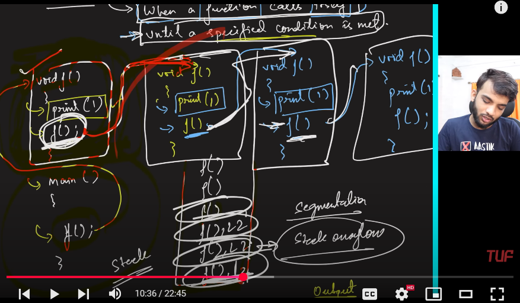
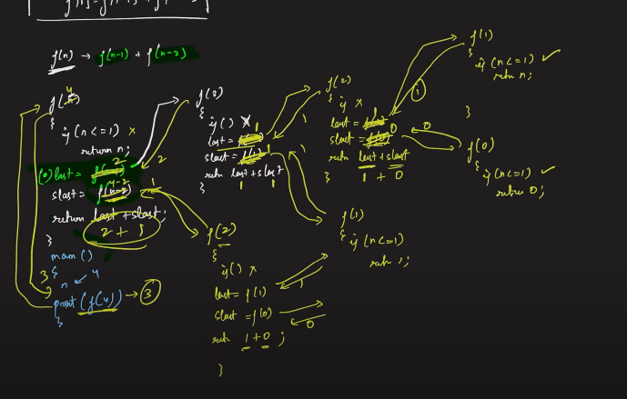

- when a function calls itself until a specific condition is met is called the Recursion
- to stop the recursion there must be base condition, such that recursion can stop

stack overflow - If we keep on calling the functions inside a function, i.e. nested recursion nested calls then 
the Memory in RAM becomes full and this is called the Stack Overflow
Numerous function calls waiting due to the recursion is called Stack Overflow

Base Condition - the condition we use to stop the recursion calling is called the base condition
there can be single as well as multiple base conditions
 